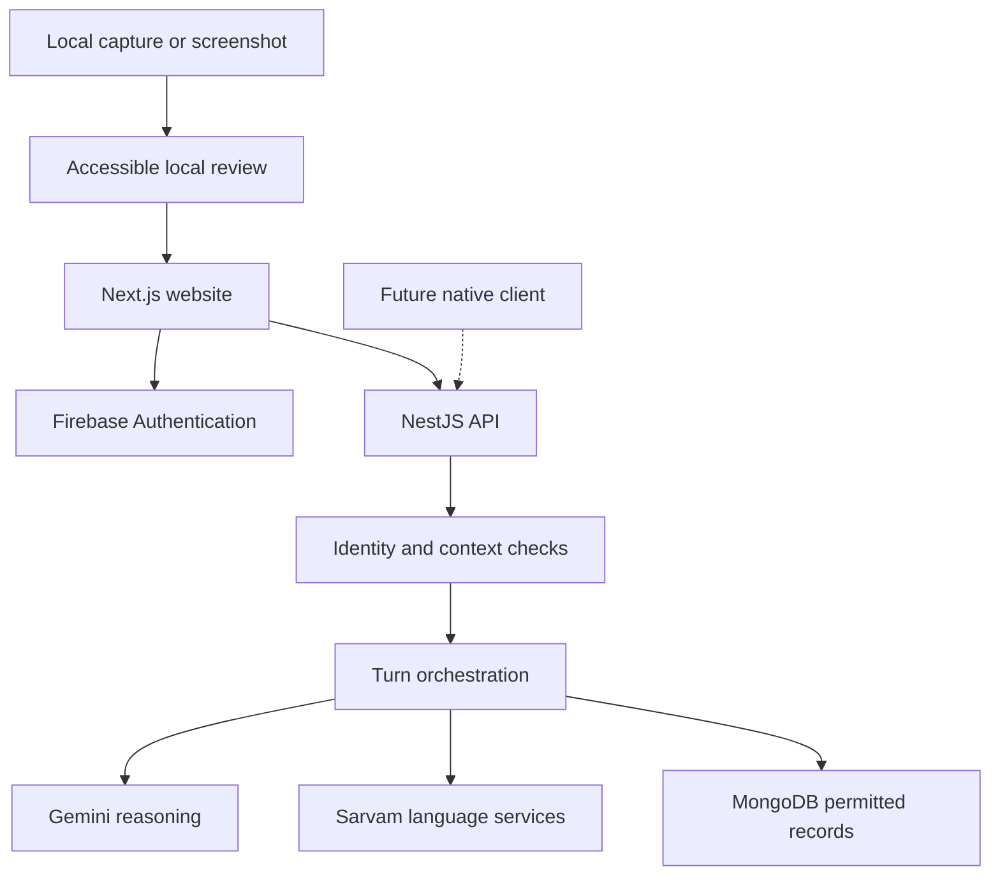
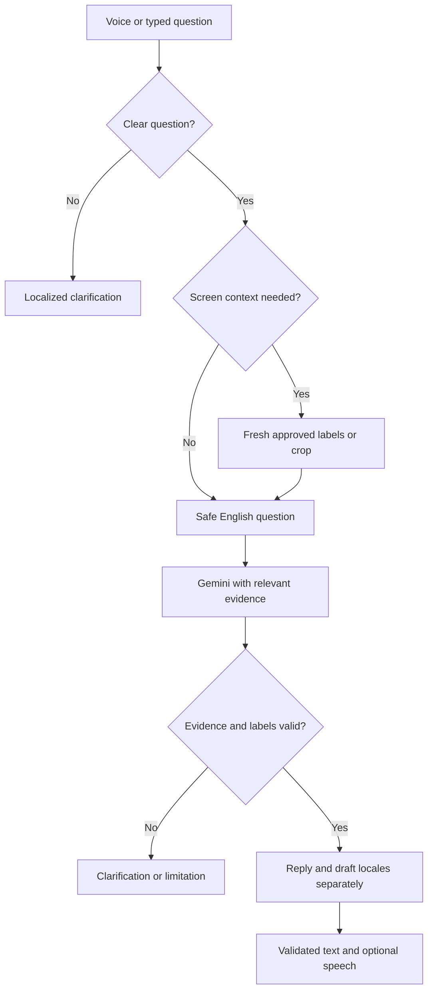
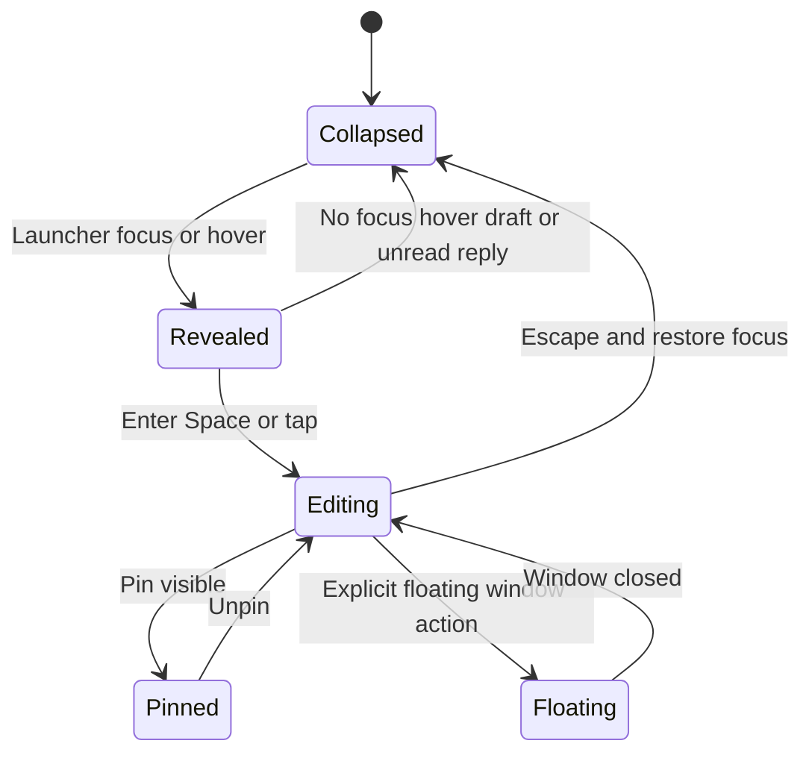
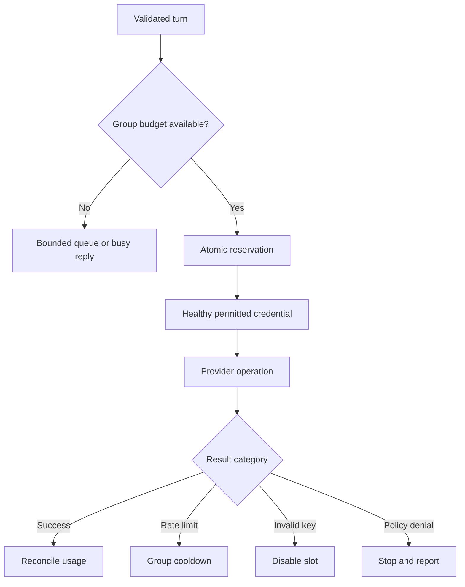

# System diagrams

Revision 3. These describe the planned system; they do not imply that application code is included. Mermaid diagrams render in compatible Markdown viewers. Read [System Design](System_Design.md) for boundary details.

## Components and trust boundaries

Raw pixels stay local until approved context is produced. Voice recording is a separate consented transfer; transcript redaction cannot protect audio already sent to Sarvam. All provider secrets remain in the API. No component has remote-click or email-send authority.

## Answer and clarification flow

STT occurs only for voice input. An unclear recording uses the selected-language recovery prompt. Source changes invalidate target selection and review; a stale request cannot speak directions for a new page. Draft language never silently changes assistance language.

## Chat interaction states

Focus reveals the in-page panel; it does not open a browser window. Typing, an unsent draft, unread reply, or pin prevents automatic collapse. Touch has explicit buttons. Keyboard shortcuts work only in a receiving assistant window; ordinary websites cannot install global hotkeys in unrelated applications. Chat movement must not duplicate microphone capture or playback.

## Quota scheduling

Four same-project Gemini slots have one project budget. Sarvam grouping follows verified account limits. Per-operation reservations must also respect any shared cross-operation/account ceiling. Two attempts per operation and two extra retries per turn are maximums, constrained by the execution deadline.

## Container boundary

Base Compose starts MongoDB only. The app overlay later adds web and API, read-only Firebase credentials, a read-only quota-policy bind mount, and readiness dependencies. The API health URL is `/api/v1/ready`. Development ports bind to localhost; mobile testing needs a deliberately configured HTTPS endpoint. See the [Docker README](../README.md) and [Compose startup documentation](https://docs.docker.com/compose/how-tos/startup-order/).
